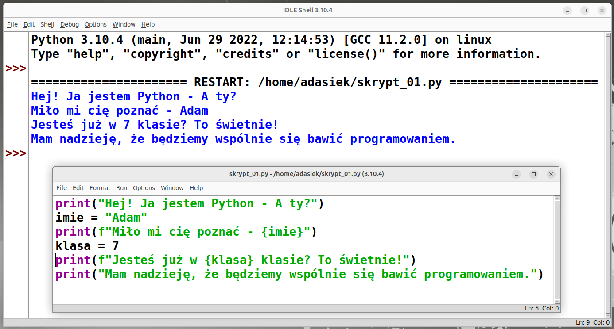

## N.07 - Środowisko Turtle w Pythonie!

----
## Dodatkowe materiały, które mogę zarekomendować:

- [Programowanie w Pythonie z Klubem Młodego Programisty --- poziom podstawowy](https://it-szkola.edu.pl/kkurs,kurs,216) [w:] Platforma OSE IT-Szkoła (Serwis prowadzony przez NASK) [online] [dostęp 2022-07-25].
- [Przykładowe kody dla operacji żółwia](https://github.com/klubmlodegoprogramisty/python/blob/main/poziom_podstawowy/Modul_10/turtle_euklides.py) [online] [dostęp 2022-07-25].
- [Dokumentacja modułu turtle](https://docs.python.org/3/library/turtle.html) [online] [dostęp 2022-07-29].
- [Funkcja - film autora w serwisie Tik-Tok](https://www.tiktok.com/@abixedukacja/video/7031115607122742533) [online] [dostęp 2022-08-01].
- [instrukcja warunkowa - film autora w serwisie Tik-Tok](https://www.tiktok.com/@abixedukacja/video/7016201797954047237) [online] [dostęp 2022-08-01].
- [import funkcji z modułu - film autora w serwisie Tik-Tok](https://www.tiktok.com/@abixedukacja/video/7034052786467720453) [online] [dostęp 2022-08-01].

